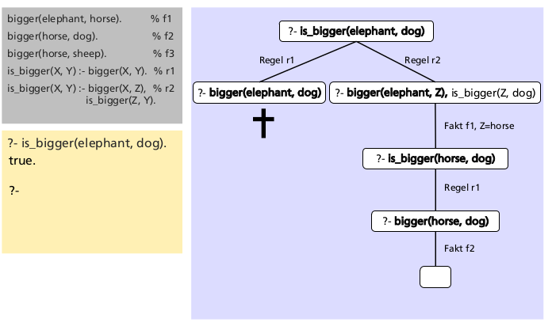

# Prolog (deklarativ logisch)

Verwendete Implementierung: SWI-Prolog, [http://swi-prolog.org](http://swi-prolog.org)  
Beispiele: [https://gitlab.enterpriselab.ch/PCP/PCP-public-Code](https://gitlab.enterpriselab.ch/PCP/PCP-public-Code)

## Basis

Es wird immer geschaut anhand der gegebenen Fakten was die Lösung ist.

* Wissensdatenbank (Knowledge Base)
  * Bestehend aus Fakten & Regeln
  * Kann abgefragt werden durch Anfragen (Queries
* Prolog-Programme bestehen aus Fakten und Regeln, die in der aktuellen Wissensdatenbank abgelegt sind


## Basissyntax

Prolog-Terme sind ausschliesslich:

* Zahlen (numbers)
  * z.B.: `123`, 4567.8, -9
* Atome (atoms)
  * beginnen mit Kleinbuchstaben oder sind eingeschlossen in einfache Anführungszeichen
  * z.B.: z.B.: `elephant`, `a_bc`, `‘Hallo mein Text‘`, #is_bigger#
* Variablen (variables)
  * z.B.: `X`, `Elephant` oder `_`
  * beginnen mit Grossbuchstaben oder einem Unterstrich (underscore)
  * Die anonyme Variable `_`
    * Jedes auftreten ist jeweils eine neue Variable
    * Instanziierungen von `_` werden nicht ausgegeben

* Zusammengesetzte Terme (compound terms)
  * z.B.: `is_bigger(horse, X)`
  * Funktor: `is_bigger`
  * Argumente (Terme): `horse`, `X`

* Atomare Terme
  * sind Atome & Zahlen

* Grundterme
  * sind alle Terme ohne Variable
  * Sind **Fakten**
  * z.B. `bigger(me, you)`, `write('bonjour')`

* Prädikate
  * wichtig eine Relation, weniger eine Funktion)
  * sind Atome und zusammengesetzte Terme
  * Praktische Bedeutung: falls Atome: **Fakten**, z.b. `bigger`
  * sonst Regeln, z.B. `is_bigger(X, Y):- bigger(X, Y)`

* Klauseln
  * Fakten und Regeln


## Prolog Anfragen:

Müssen jeweils mit einem `.` abgeschlossen sind

Ein `,` Bedeutet ein und

Eine Programm Datei kompilieren:

    ?- consult(bigger).
    % bigger.pl compiled 0.00 sec, 12 clauses
    true.
    ?-

## Klauseln (Regeln  & Fakten), Prozeduren & Programme

* Klauseln (clauses) = Fakten und Regeln (sind zusammengesetzte Terme)
  * Fakten: Prädikate gefolgt von einem Punkt
    * Fakten definieren etwas als bedingungslos wahr
    * z.B. `bigger(elefant, horse)`
    * z.B. `parent(peter, mary)`
    * Fakten sind Typischerweise Grundterme und haben keine Variablen
  * Regeln (rules) bestehen aus einem head und body & sind durch :- getrennt
    * Der Kopf einer Regel ist wahr, falls alle Prädikate im Hauptteil war sind  
      ```
      grandfather(X, Y) :- % head
          father(X, Z),  % body, goal 1
          parent(Z, Y).  % body, goal 2
      ```
    * sind eigentlich Hornklauseln:  
      
    * Prolog verwendet dafür SLD-Resolution (Selective Linear Definitive Clause Resolution)
      
* Prozedur (procedure) = Alle Klauseln zum gleichen Prädikat
  * d.h. Alle Relationen mit gleichem Name, d.h. Gleicher Funktor und Stelligkeit
* Prolog-Programm: eine Lsite von Klauseln.

## Matching

**Definition:** Zwei Terme "matchen", wenn sie identisch sind oder wenn sie durch Ersetzen von Variablen durch andere Terme identisch gemacht werden können

Mit dem Gleichheitsprädikat (infix) operator `=`. Alternativ kann auch als `=(a, b)` geschrieben werden.

3 Regeln von Matching:

* Atom & Atom: `tom = tom.` gleiche atomare Terme machten
* Variable & Atom: `X = 'test'`, die variable X wird aufgelöst
* Zusammengesetzte Terme, auch Prädikate
  * gleicher Funktor, gleich Stelligkeit
  * alle korrespondierenden Argumente Machten
* *Achtung Ausnahme*: `X = f(X).` gibt `X = f(X)` und wird nicht unendlich lang
  Ausgeführt. Dies funktioniert, weil Prolog keinen "occurs check" macht.
  * Wenn man trotzdem das verhalten von Unifikation anstatt von Machine haben will kann man
   `unify_with_occurs_check/2` verwendet werden.

## Beweissuche und Suchbäume

Prolog macht immer das selbe. Wenn eine Anfrage kommt prüft es ob dies auf etwas in der Wissensdatenbank mached.

Es wird sequenziell, von oben nach unten in der Wissensdatenbank gesucht.
Die Anfrage wird von links nach rechts versucht aufzulösen.


Der Baum wird von oben bis unten abgearbeitet und versucht dies Wahr zu machen.
Ist man an einem Blatt angekommen wird Backtracking verwendet falls keine Lösung gefunden wurde.
Backtracking ist *Tiefensuche* (es wird erst versucht auf die Blattknoten zu kommen).
Dies ist aber nicht sonderlich effizient
(`O(k^n)`, `k` = Nummer an Verzweigungen, `n` tiefe des Baumes).

Sobald die Anfrage-Klausel leer wurde eine Lösung gefunden.
Es kann dann zum Wurzelknoten zurückgegangen werden, um die Lösung zurückzugeben.
Es kann aber natürlich auch sein das es mehrere Lösungen gibt.

Falls Sie selber Suchbäume zeichnen (z.B. für Übungen oder Modulendprüfungen (MEP)): Korrekt zeichnen, d.h. insbesondere:

* Verwendete Regel bzw. Fakten pro Schritt angeben
* Pro Schritt genau einen Ziel-Term eliminieren (d.h.  keine Schritte überspringen oder zusammenfassen!)
* Pro Schritt Variablen-Matchings angeben

## Deklarative & Prozedurale Bedeutung

Wir wussten bis jetzt nicht wie Prolog jeweils auf die Lösungen kommen.
Es macht daher Sinn, zwischen folgenden zwei Bedeutungsebenen von Prolog-Programmen zu unterscheiden:

* Deklarative Bedeutung: **WAS**
  * Hier geht‘s ausschliesslich um die im Programm definierten Relationen, diese definieren was die Ausgabe vom Programm sein wird
  * Beschreibung des Problems
* Prozedurale Bedeutung: **WIE**
  * Hier geht‘s darum, wie diese Ausgabe aus den definierten Relationen abgeleitet werden kann
  * Beschreibung der Problemlösung, es wird ein Lösungsweg vorgeben

Für Prolog reicht es grundsätzlich die deklarative Bedeutung anzugeben!

## Gebundene und ungebundene Operanden, is/2

In der Doku von SWI-Prolog stehen bei Prädikaten
typischerweise vor jedem Operand `-`, `+` oder `?`:

* `-`: Operand sollte ungebunden/nicht instanziiert sein/eine Variable. Der Wert wird also durch ein Prädikat zugewiesen.
* `+`: Operand sollte gebunden/instanziiert sein.d.h. eine Zahl, ein Atom oder ein gebundener zusammengesetzter Term. Der Wert wird vom Prädikat "gebraucht".
* `?` bedeutet: Operand kann gebunden oder ungebunden sein

z.B für `is/2`:

    -Number is +Expr

Das heisst (erzwingt die Auswertung von 1 + 2):

    X is 1 + 2

    -> X = 3

## Arithmetrische Operatoren/Prädikate


* `+`: Addition
* `-`: Subtraktion
* `*`: Multiplikation
* `/`: Division
* `**`: Potenz
* `//`: Ganzzahldivision
* `mod`: Modulo (Rest bei Ganzzahldivision)

Full list here: [http://www.swi-prolog.org/pldoc/man?section=functions](http://www.swi-prolog.org/pldoc/man?section=functions)

## Vergleichsoperatoren/Prädikate

Achtung: Diese erzwingen die Auswertung beider ihrer operanden!

* `>`: grösser als
* `<`: kleiner als
* `>=`: grösser-gleich
* `=<`: kleiner-gleich
* `=:=`: Gleichheit (nicht verwechseln mit Matching `=`!)
* `=\=`: Ungleichheit 

## Eigene Operatoren erstellen

Operatoren könne einfach aus prädikaten erstellt werden.

Alle oben definierten operatoren sind eigentlich auch prädikate, e.g. `>/2` für grösser als. `>(2, 3).` würde auch funktionieren.


Dies passiert mit `op/3`:

    op(+Precedence, +Type, :Name)

Example:

    ?- op(1150, xfx, is_bigger).
    true. % declare new operation
    ?- elephant is_bigger dog.
    true.


* Precedence 0 removes the declaration
* Precedence must be between 0 and 1200
* Je kleiner die Precedence desto stärker bindet der operator
  * e.g.  er wird früher ausgeführt!
  * klammern haben die Precendence 0!
* Type is one of: `xf`, `yf`, `xfx`, `xfy`, `yfx`, `fy` or `fx`.
  * The `f` indicates the position of the functor, while `x` and `y` indicate the position of the arguments
  * `y` should be interpreted as "on this position a term with precedence lower or equal to the precedence of the functor should occur".
  * For `x` the precedence of the argument must be strictly lower.
* Operator-Typen:
  * Infix: `xfx`, `xfy`, `yfx`, e.g. `1 * 2`
  * Präfix: `fx`, `fy`, e.g. `-1`
  * Postfix: `xf`, `yf`


See: [https://www.swi-prolog.org/pldoc/man?predicate=op/3](https://www.swi-prolog.org/pldoc/man?predicate=op/3)

### Vordefinierte Operatoren:

Precedence | Type | Name
----------:+-----:+:-----------------------------------------------------
1200       | xfx  | `-->`, `:-`
1200       | fx   | `:-`, `?-`
1150       | fx   | `dynamic`, `discontiguous`, `initialization`, `meta_predicate`, `module_transparent`, `multifile`, `public`, `thread_local`, `thread_initialization`, `volatile`
1100       | xfy  | `;`, `|`
1050       | xfy  | `->`, `*->`
1000       | xfy  | `,`
990        | xfx  | `:=`
900        | fy   | `\+`
700        | xfx  | `<`, `=`, `=..`, `=@=`, `\=@=`, `=:=`, `=<`, `==`, `=\=`, `>`, `>=`, `@<`, `@=<`, `@>`, `@>=`, `\=`, `\==`, `as`, `is`, `>:<`, `:<`
600        | xfy  | `:`
500        | yfx  | `+`, `-`, `/\`, `\/`, `xor`
500        | fx   | `?`
400        | yfx  | `*`, `/`, `//`, `div`, `rdiv`, `<<`, `>>`, `mod`, `rem`
200        | xfx  | `**`
200        | xfy  | `^`
200        | fy   | `+`, `-`, `\`
100        | yfx  | `.`
1          | fx   | `$`

Warning:


*   It is not allowed to redefine the comma (',').
*   The bar (|) can only be (re-)defined as infix operator with priority not less than 1001.
*   It is not allowed to define the empty list ([]) or the curly-bracket pair ({}) as operators.


## Rekursion




## Optimierung: Endrekursion (tail recurson)

* nur einen rekursiven Aufruf hat
* dieser rekursive Aufruf ist der letzte Aufruf in der letzten Klausel dieser Prozedur
* Zusätzlich müssen die Aufrufe vor dem rekursiven Aufruf alle deterministisch sein

Das heisst es ist eigentlich kein Backtracking notwendig!

* Die Endrekursion kann als Iteration ohne zusätzlichen Speicherplatz ausgeführt werden

Example (last call optisation:

    p(...) :- ..., % all deterministic and
              ...,
             p(...).  % here: tail-recursive call

### Optimierung Fibonacci

Beispiel:

    fib(0, 0).
    fib(1, 1).
    fib(N, F) :-
        N > 1,
        N1 is N – 1, N2 is N - 2,
        fib(N1, F1), fib(N2, F2),
        F is F1 + F2.

Problem: Zwei rekursive aufrufe, Komplexität `O(2^n)`

    ?- fib(30,X).
    ERROR: Out of local stack

Lösung, tail recursion:

    fib_tr(N, F) :- fib_tr(N, 0, 1, F). % call accumulator
    fib_tr(0, A, _, A).                 % simple case
    fib_tr(N, A, B, F) :-               % general case
        N1 is N – 1,                    % new argument N1
        N1 >= 0,                        % avoid underflow
        Sum is A + B,                   % accumulator Sum
        fib_tr(N1, B, Sum, F).          % tail-recursisve call

Bei der Umwandlung braucht es typischerweise weitere argumente, sogenannte akkumulatoren.

## Optimierung Memoization: Optimierung durch Assertions


Viele Zwischenresultate werden mehrmals berechnet.
Die andere Möglichkeit besteht darin assertions zu verwenden um Fakten während der laufzeit zwischenzuspeichern.

Dafür gibt es `assert/1` und `assert/2`

    assertz(bigger(me, you))   % Füge fakt am ende an der Wissensdatenbank an
    asserta(bigger(you, me))  % Füge fakt am anfang der Wissensdatenbank an
    % macht keinen sinn aber beides ist dann in der Datenbank!

Achtung die wissensdatenbank wird von oben nach unten durchsucht.

Mit `retract/1` kann ein Fakt wieder aus der Wissensdatenbank entfernt werden.

### Optimierung mit Assertions

Um gewisse Teilresultate nicht mehrmals zu berechnen, kann dies als Fakt in der Wissensdatenbank abgelegt werden.

    :- dynamic fib_as/2.
    fib_as(0, 0).                           % base case 1
    fib_as(1, 1).                           % base case 2
    fib_as(N, F) :-                         % general rule
        N > 1,                              % allow no negative numbers
        N1 is N-1,
        N2 is N-2,
        fib_as(N1, F1),                     % calculate F1 = fib(N-1)
        fib_as(N2, F2),                     % calculate F2 = fib(N-2)
        F is F1+F2,
        asserta(fib_as(N, F)).            % % assert new fact


### Kontrollfragen:

1. Warum kann eine endrekursive Prozedur von Prolog effizienter ausgeführt werden, als eine nicht-endrekursive Prozedur?

Weil diese in eine Iteration übersetzt werden kann indem man die Laufenden Variabeln zu akkumulatoren umwandelt anstatt diese auf dem Call-Stack abzulegen. Im falle von fibonacci konnte somit auch die komplexität verringert werden.

2. Beschreiben sie in eigenen Worten, auf was für einer Beobachtung "Optimierung mit Assertions" beruht und wie diese konkret in Prolog umgesetzt wird.

Um gewisse Teilresultate nicht mehrmals zu berechnen, kann dies als Fakt in der Wissensdatenbank abgelegt werden.

## Listen

* Eine Liste ist eine endliche Sequenz von Elementen
* Listen können in Prolog mit Hilfe von `[ ]` (eckigen Klammern) dargestellt werden, z.B.:

    ?- X = [a, b, c].
    X = [a, b, c].
    ?- Y = [d, e, f(X), [x, y]].
    Y = [d, e, f(X), [x, y]].
    ?- Z = [].
    Z = [].

**Eigenschaften**:

* Die Elemente einer Liste werden in eckigen Klammern eingeschlossen und durch Komma getrennt
* Die Länge einer Liste ist die Anzahl Elemente, welche in dieser Liste enthalten sind
* Listen-Elemente sind beliebige Prolog Terme
  * Also z.B. Atome, Zahlen oder wiederum Listen
* Es gibt eine spezielle Liste, nämlich die leere Liste, angegeben als `[]`
* Eine nicht leere list besteht immer aus:
  * Kopf (head): das erste element
  * Schwanz (tail): wiederum eine liste der restelemente (alle ausser head)
  * `|`-Operator:

        % extrahieren von head und tail
        ?- [a, b, c] = [Head | Tail].
        Head = a,
        Tail = [b, c].

        % damit kann auch eine Liste zusammengesetzt werden
        ?- L = [a | [b, c]], L = [a, b | [c]], L = [a, b, c | []].
        L = [a, b, c].

        % Mit maching das zweite und dritte element extrahieren
        ?- [_, X2, X3 | _] = [a, b, c, d, e, f].
        X2 = b,
        X3 = c.

### Kontrollfragen

1. Was antwortet Prolog auf die folgende Anfrage: `X = [a | [b]].`?

    ?- X = [ a | [b] ]
    |    .
    X = [a, b].

2. Was antwortet Prolog auf die folgende Anfrage: `[1, 2, 3] = [_ | X].`?

    ?- [1, 2, 3] = [_ | X].
    X = [2, 3].

3. Und was auf diese: `[a, b, c] = [_, X | Y].`?

    ?- [a, b, c] = [_, X | Y].
    X = b,
    Y = [c].

4. Warum ist es in Prolog i.A. effizienter auf das erste, als auf das letzte Element einer Liste zuzugreifen?

Es handelt sich um eine linked list und das erste element (head) hat einfach einen pointer auf die restelemente (tail).

## Listenoperationen

## Listenzugehörigkeit member/2

Hier am beispiel von: `mem/2` (bereits in prolog als `member/2`)

Für diese Relation soll z.B. gelten:

* `mem(b, [a, b, c])` stimmt
* `mem(b, [a, [b, c]])` stimmt nicht
* `mem(d, [a, b, c])` stimmt nicht
* `mem([b, c], [a, [b, c]])` stimmt

Implementation:

    mem(X, [X | _]).                     % element is at the beginning of the list, return true
    mem(X, [_ | Tail]) :- mem(X, Tail)   % else search the rest of the list

Verwendung:

    ?- mem(a, [a, b, c]).
    true. % is a member of [a, b, c]?
    ?- mem(d, [a, b, c]).
    false.

    % alle listenelemente
    ?- mem(X, [a, b, c]).
    X = a;
    X = b;
    X = c;
    false.

    ?- mem(hslu, L).  % of which list L is hslu a member of?
    L = [hslu|_G2031];
    L = [_G2030, hslu|_G2034];
    L = [_G2030, _G2033, hslu|_G2037];
    L = [_G2030, _G2033, _G2036, hslu|_G2040];

    ?- mem(a, L), mem(b, L), mem(c, L). % which list L contains a, b, & c?
    L = [a, b, c|_G2239];
    L = [a, b, _G2238, c|_G2242];
    L = [a, b, _G2238, _G2241, c|_G2245];

    % Erzeugung allter permutationen der länge 3 welche a, b und c enthalten
    ?- L = [_, _, _], mem(a, L), mem(b, L), mem(c, L).
    L = [a, b, c];
    L = [a, c, b];
    L = [b, a, c];
    L = [c, a, b];
    L = [b, c, a];
    L = [c, b, a];
    false.

### Listenkonkatenation conc/3

Wir wollen wissen, ob Liste L1 und Liste L2 zusammenhängt Liste L3 ergeben

Für `conc(L1, L2, L3)` soll gelten:

* `conc([a, b], [c, d], [a, b, c, d])` stimmt
* `conc([a, b], [c], [a, b, c, d])` stimmt nicht
* `conc([a, b, c], [d], [a, b, c, d])` stimmt
* `conc([a, b, c], [], [c, b, a])` stimmt nicht

Implementation:

    conc([], L, L).                   % die zweite liste ist gleich die erste liste
    conc([X | L1 ], L2, [ X | L3 ] ) :- conc(L1, L2, L3).
    % die erste und dritte liste wird elementweise verglichen, bis L1 abgearbeitet ist


Beispiele:


Zwei listen zusammenhängen:

    ?- conc([a, b], [c, d], L).
    L = [a, b, c, d].
    ?- conc([a, b], [c], [a, b, c, d]) .
    false.
    ?- conc([a, [b, c], d], [a, [], b], L).
    L = [a, [b, c], d, a, [], b].

Zerlegung einer Liste in alle Möglichen Teillisten:

    ?- conc(L1, L2, [a, b, c]).
    L1 = [],
    L2 = [a, b, c];
    L1 = [a],
    L2 = [b, c];
    L1 = [a, b],
    L2 = [c];
    L1 = [a, b, c],
    L2 = [];
    false.

### Kontrollfragen

`conc/3` sei wie oben beschrieben definiert.

1. Was antwortet Prolog auf die folgende Anfrage: `conc(L, [c], [a, b, c]).`?

    ?- conc(L, [c], [a, b, c]).
    L = [a, b] .

2. Was antwortet Prolog auf die Anfrage `conc(Before, [d | After], [a, b, c, d, e, f, g, h]).`?

    ?- conc(Before, [d | After], [a, b, c, d, e, f, g, h]).
    Before = [a, b, c],
    After = [e, f, g, h] ;
    false.

3. Und was auf `conc([a], L, [b, c]).`?

  ?- conc([a], L, [b, c]).
  false.


4. Bonusaufgabe (anspruchsvoll): Wie lässt sich mem/2 unter Verwendung von conc/3 ausdrücken? (D.h.  als neues Prädikat der Form mem_c(X, L) :- ...conc...)

    mem_2(X, L) :- conc(_, [X | _], L)

Ähnlich wie Kontrollfrage 2.


## Konkunktion, Disjunktion

Konjunktion (AND) mit `,`:

  X = Y, Y = Z.

Disjunktion:

    rich(tom).
    nice(mary).
    interesting(X) :-
        rich(X);       % OR HERE
        nice(X).

Disjunktionen werden aber selten verwendet, da man auch einfach zwei Regeln verwenden kann:

    interesting1(X) :- rich(X); nice(X).
    interesting2(X) :- rich(X).
    interesting2(X) :- nice(X).


## Cut-Operator (`!`)


Die Lösungsmenge kann mit dem Cut-Operator verkleinert werden, damit ein
gewisser teil des suchbaums nicht abgesucht werden muss.

Dies kann das Backtracking schneller machen und gibt uns etwas Kontrolle über
den Backtracking Prozess.

* Nimmt keine Argumente
* Ist immer erfüllt
* Bindet die bisherige Wahl (in Bezug auf Backtracking) innerhalb der aktuellen Klausel
  * Das heisst es kann keine andere regel mehr gewählt werden (siehe `max2/2`).
  * Bindet uns an die gewählte Regel

Beispiel:

    p(X):- b(X), !, c(X).

Suchbaum ohne cut:


Suchbaum mit cut:


Was der Cut bewirkt

* Der Cut bindet in der aktuellen Regel die Wahl aller Ziele im Hauptteil (body) links vom Cut-Operator
* Wenn wir also bei einer Regel der Form

      q :- p 1 , ... , p n , !, r 1 , ... , r n .

  im Suchbaum den Cut erreichen, dann bindet uns das:
* zu dieser spezifischen Klausel von q
* zu den Wahlen getroffen durch p 1 bis p n
* NICHT zu den Wahlen getroffen durch r 1 bis r n

Max:

    max(X, Y, X) :- X >= Y. % r1: X is the max
    max(X, Y, Y) :- X < Y. % r2: Y is the max


Max2 (mit cut)

    max2(X, Y, Z) :- X >= Y, !, X = Z.
    max2(_X, Y, Y).

`mem(X, L)` gibt so viele Lösungen wie die Liste enthält.
Listenzugehörigkeit mit einer Lösung (`mem_det`). 

    mem_det(X, [X | _]) :- !.
    mem_det(X, [_| Tail]) :- mem_det(X, Tail).

### Green cut

Cuts welche die deklarative Bedeutung *nicht verändert* (Lösungsmenge wird nicht eingeschränkt).
Bsp. `max/2`.

### Red cut

Cuts welche die deklarative Bedeutung *verändert* (Lösungsmenge wird eingeschränkt).

Bsp. `mem_det/2`

* sind nicht vollständig deklarativ
* sind schwer zu lesen und verstehen
* können zu subtilen programmierfehlern führen

Red Cuts nur mit Sorgfalt verwenden.
