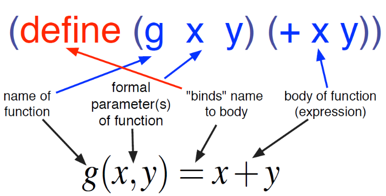

# PCP FS2020: Scheme Zusammenfassung

Ist deklarativ funktional. (Wie auch LISP, ML basierende Sprachen (F#, OCaml), wie auch Haskell)

## Literatur (online)

* The Scheme Programming Language, R. Kent Dybvig
  * [www.scheme.com/tspl4/](http://www.scheme.com/tspl4/)
* Structure and Interpretation of Computer Programs, Harold Abelson and Gerald Jay Sussman (also commonly known as "The Wizard Book" for programmers)
  * [mitpress.mit.edu/sites/default/files/sicp/full-text/book/book.html
](https://mitpress.mit.edu/sites/default/files/sicp/full-text/book/book.html)
* How to Design Programs, Matthias Felleisen u.a.
  * [www.htdp.org](http://www.htdp.org)

## Lisp

Erste Deklarativ Funktionale Sprache.

* Inspiriert vom Lambda Kalkulus.
* Homoikonizität: Selbst-Abbildbarkeit, oder Selbst- Repräsentierbarkeit
  * Programme in einer Sprache sind gleichzeitig Datenstrukturen in derselben Sprache.
  * in lisp ist jedes Programm eine Liste

Es gibt viele verschiedene LISP dialekte:

* Aus Lisp enstand Common Lisp
* Scheme basiert auf Common Lisp
* Raket ist ein Scheme dialekt

## Prinzipen der funktionalen Programmierung

Im Zentrum stehen

* Funktionen, und die
* Anwendung von Funktionen.

Das heisst:

* Keine Seiteneffekte
* Funktionen sind auch Datenobjekte (Values, Werte)
  * Dies erlaubt Funktionen höherer Ordnung (Funktionen die Funktionen als Parameter)
* Verschiedene Implementationen von Funktionen für verschiedene Typen
* kürzere klarere, einfacher wartbare, zuverlässigere und schnellere programme

Lösen einer Aufgabe anhand von Dekomposition und Komposition

* Zerlegung in Unterprobleme,
* Abtraktion/zusammenfassung ähnlicher Probleme

## Racket

DrRacket ist eine IDE für racket und erlaubt es auch andere scheme dialekte auszuprobieren.

## Scheme Basics

Ist dynamisch typisiert (typenprüfung findet während der Laufzeit statt).

Ein Programm:

    ; Mittelwert der Quadratzahlen 0..n-1
    (define (mean-of-squares n)
      (/ (apply + (build-list n sqr)) n))

###  Primitive (Atomare) Ausdrücke: Werte

* Zahlen
  * sind *selbst-auswertend* (Werte der Ziffern sind die Zahl die sie bezeichnen)
  * integer: 23
  * rational:  -3/4, 0.75
  * real: +inf.0
  * irrational: pi = #3.141592653...
  * komplexen Zahlen (complex), sqrt(-2) = #i0+1.4121356
* Booleans
  * sind *selbst-auswertend*
  * Werte true/false, `#t`, `#f`, `#true`, `#false`

### Eingebaute Operatoren (built-in functions)

* Eine Auswertung ergibt den Wert derartigen Operation
* Die in Scheme eingebauten mathematischen Funktionen werden PRIM-OPS (Primitive operations) genannt.
* integer operations:
  * `+`, `-`, `*`, `/`
  * `quotient` (Ganzzahldivision), `remainder`, `modulo` (Rest)
  * `expt`, `lcm`
  * `abs`, `max`, `min`
  * `numerator` (Zähler), `denominator` (Nenner), `gcd`
* real and complex operations:
  * `exp`, `sin`, `cos`, `tan`, `expt`, `log`, `sqr`, `sqrt`

### Form

Alles in Scheme ist eine Form.

    `(operator operand1 operand2 ...)` -> `(+ 1 2)`

Eine Form:

* wird mit klammern umschlossen.
* verwendet Präfix-Notation, der operator (oder funktion) zuerst dann alle argumente

#### Auswertungsregeln

* Reihenfolge der Auswertung ist nicht festgelegt.
* Die Auswertung ist aber Rekursiv
* Jede sub-Form muss aber ausgewertet werden bevor die gesammte Form ausgewertet werden kann.

## Kontrollfragen A

Was ist falsch an den folgenden Ausdrücken?

* `(5 * 14)`, präfixnotation, operator zuerst -> `(* 5 14)`
* `(* (5) 3)`, 5 ist kein definierter operator -> `(* 5 14)`
* `(+ (* 2 4)`, klammer am ende vergessen -> `(+ (* 2 4))`
* `(* + 3 5 2)`, jeder operator braucht wieder eine klammer -> `(* (+ 3 5) 2)`
* `(/ 25 0`), man kann nicht durch null teilen

## Namen (define ...) und Konstanten

In funktionalen Sprachen wird der Bezeichner (name) an einen Ausdruck oder Wert gebunden.

In Scheme wird dafür `(define ...)` verwendet:

    (define <identifier> <expression>)

* `<identifier>`: beliebiger Name, kann auch sonderzeichen enthalten
* `<expression>`: beliebiger Ausdruck, konstante/variable/funktionsaufruf
* bindet die `<expresseion>` an den Namen `<identifier>`

Example Constants:

    (define pi 3.14159)
    (define PI 3.14159) # achtung: neudefinition da case insensitive

### Auswertungsregeln

* Wertet den `<identfier>` **nicht** aus
* Der Rückgabewert von define ist nicht spezifiziert
* Scheme unterscheidet **nicht** zwischen Gross/Kleinschreibung
  * In Dr Racket kann man case-sensitivity aber einstellen

## Kontrollfragen B

1. Scheme ist dynamisch typisiert. Was bedeutet das?  
  Die Typenprüfung findet während er Laufzeit statt.
2. Wie wird der folgende Ausdruck schrittweise ausgewertet?  `(* (- 6 4) (+ 3 2))`
  1. `(* 2 (+ 3 2))`
  2. `(* 2 5)`
  3. `10`
3. Wie sehen die Auswertungsregeln für allgemeine Formen aus?
  * Die Reihenfolge der Auswertung ist nicht festgelegt
  * Die Auswertung ist rekursiv
  * Jede sub-Form muss ausgewertet werden bevor die gesamte Form ausgewertet werden kann.
4. Wie sieht die Auswertungsregeln für die spezielle Form define aus?
  * Der Zweite Ausdruck ist ein Name der gebunden wird an den Wert des dritten Ausdrucks
  * Der Zweite Ausdruck wird nicht ausgewertet
  * Der Dritte Ausdruck wird ausgewertet
  * Der Rückgabewert von define ist nicht spezifiziert

## Name (define ...) und Funktionsdefinitionen

* Funktionsdefinitionen bilden das Programm
* Es gibt keine Main Funktion

Definieren einer Funktion mittels `(define ..)`:

    (define (<identifier> <formal parameters>) <expression>)

Beim Aufruf einer Funktion müssen die aktuellen Parameter in

- Anzahl
- Datentyp (implizit; kann nicht angegeben werden, da dynamisch typisiert)
- Reihenfolge

mit den *formalen parameter* übereinstimmen.

Beispiel (Berechnung einer Kreisfläche/Ringfläche):

    (define (area-of-disk r) (* PI (sqr r)))
    (define (area-of-ring outer inner)
      (- (area-of-disk outer) (area-of-disk inner)))

Konsole, Aufruf der Funktion:

    > (area-of-disk 5)
    78.53975
    > (area-of-ring 5 3)
    50.264

### Auswertungsregeln für Funktionen

* *Primitive Funktionen* werden einfach ausgewertet die Anweisungen im Rumpf ausgeführt werden.
* *Zusammengesetze oFunktionen* werden ausgeweret. Werte den Rumpf der Funktion aus. Dabei werden alle formalen Parameter mit dem aktuellen Parameterwert ersetzt.
  Beispiel Trace:

      (area-of-ring 5 3)
      (- (area-of-disk 5) (area-of-disk 3))
      (- (* pi (sqr 5)) (* pi (sqr 3)))
      (- (* 3.14159 (sqr 5)) (* 3.14159 (sqr 3)))
      (- (* 3.14159 25) (* 3.14159 9))
      (- (78.5375) 28.2735)
      50.264

Scheme-Interpreter verwenden die **strikte Auswertung**.
Eine Form mit Schlüsselwort definiert somit eine eigene Auswertung.

Es gibt verschiedene Auswertungsstrategien, die jeweils verschiedene Ergebnisse liefern.

* Bei der **strikten Auswertung** werden alle Argumente ausgewertet
bevor die Funktion aufgerufen wird.
* Bei der **Bedarfsauswertung (Lazy Evaluation)** werden die
Argumente als unausgewertete Ausdrücke übergeben. Die
Auswertung erfolgt erst dann, wenn deren Wert benötigt wird.
  - Funktionsaufrufe können ganz vermieden oder zumindest teilweise eingespart werden können.
* Ein auf logische Ausdrücke eingeschränkter Spezialfall ist die **Kurzschlussauswertung**.

## Funktionale Modellierung

Ein programm besteht aus

* Funktionen
  * Hauptfunktion: Hauptziel der Berechnung
  * Hilfsfunktionen
* Variabeln
  * Vordefiniertes `pi` oder `e`
  * eigene Definitionen

Ziel ist es das Wesentliche darzustellen, während unnötige Details verborgen werden. Hierarchische struktur.

Top-Down verfahren/Abhänigkeits-Analyse zur Problemlösung.

## Aufgabe: Profit eines Kinos

Ein Programm soll den Profit eines Kinobesitzers in Abhängigkeit vom
Ticketpreis berechnen:

* Bei CHF 8.00 pro Ticket kommen 120 Leute
* Pro CHF 0.50 Rabatt kommen 15 Leute mehr
* Fixkosten einer Aufführung sind CHF 250
* Variablen Kosten eines Besuchers betragen CHF 0.75

Lösung:

    (define (profit price)
      (- (revenue price) (cost price)))
    (define (revenue price)
      (* (attendees price) price))
    (define (attendees price)
      (+ 120 (* 15 (/ (- 8.00 price) 0.50))))
    (define (cost price)
      (+ 250 (* 0.75 (attendees price))))

## Kontrollfragen C

1. Worauf muss man achten bei der Funktionsdefinition mit Hilfe von `define`?
  * dyanmisch typisiert
  * keine typen angeben
  * aufpassen beim Aufruf mit der Reihenfolge der Parameter
2. Gegeben sind die Funktionen:

      (define (f x) (* x x))
      (define (g x y) (+ x y))

   Wie wird `(g (g 1 3) (f 2))` ausgewertet?

   1.  `(g (g 1 3) (f 2))`
   2.  `(g (+ 1 3) (f 2))`
   3.  `(g (+ 1 3) (* 2 2))`
   4.  `(g 4 (* 2 2))`
   5.  `(g 4 4)`
   6.  `(+ 4 4)`
   7.  `8`

3. Ändern Sie das vorhergehende Programm entsprechen den neuen Angaben und ermitteln Sie den «optimalen» Preis.
  * Der Besitzer erreicht durch Rationalisierungsmassnahmen, dass die Kosten pro Zuschauer einfach CHF 2.00 betragen.  Ändern Sie das Programm entsprechen und ermitteln Sie den «optimalen» Preis

        (define (profit price)
          (- (revenue price) (cost price)))
        (define (revenue price)
          (* (attendees price) price))
        (define (attendees price)
          (+ 120 (* 15 (/ (- 8.00 price) 0.50))))
        (define (cost price)
          (* 2.00 (attendees price)))

  * Der Optimale Preis ist 7

        > (profit 8)
        720.0
        > (profit 6.5)
        742.5
        > (profit 7.1)
        749.7
        > (profit 6.9)
        749.7
        > (profit 7)
        750.0
