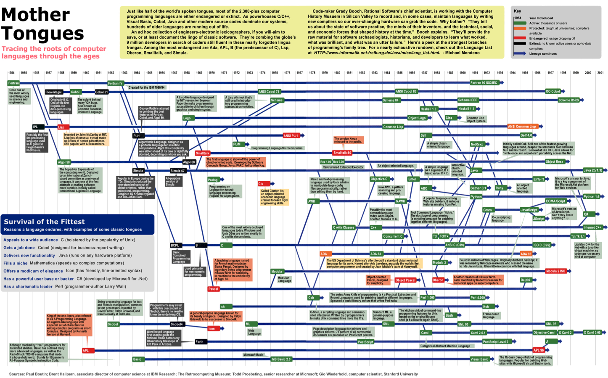
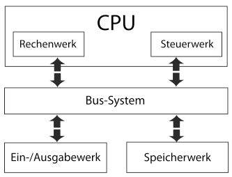

# SW01: Einführung Programmierparadigmen

## Übersicht programmierparagigmen

** Definition: **

> Programmierparadigma = fundamentaler
> Programmierstil, eine bestimmt Art die Struktur
> und Elemente von Programmen aufzubauen

Auszug von verschiedenen Definitionen von „Paradigma“:

– Beispiel, Muster (http://www.duden.de/rechtschreibung/Paradigma)
– Denkmuster, Schema, eine grundlegende wissenschaftliche Denkweise (http://de.wiktionary.org/wiki/Paradigma)
– grundsätzliche Denkweise. [...] eine bestimmte Art der Weltanschauung ode

* Imperative Programmierung
  * **WIE**: Imperativ = unbedingte Anweisung
  * Schrittweise Anweisungen wie das Problem zu lösen ist
  * *Bespiel:* Kreis: Resultat einer 360 Grad Rotation um einen
festen Mittelpunkt mit dem Zirkel
  * Unterparadigmen:
    * strukturiert
    * prozedural
    * objektorientiert
* Deklarativ Programmierung
  * **WAS**: Deklaration = Erklärung
  * Berechnungslogik wird beschrieben ohne den Kontrollfluss, was sind die Fakten zum Problem
  * *Bespiel:* Kreis: aller Punkte, die von einem vorgegebenen Punkt denselben Abstand hat
  * Unterparadigmen:
    * logisch
    * funktional
    * Weitere..
* Weitere...

## Sprachen & Paradigmen

* Sprachen müssen nicht exklusiv einem Programmierparadigma angehören
* Sprachen haben aber ein Hauptparadigma
* Unterscheidung ist nicht messerscharf
  * Objektorientierte sind auch strukturiert und prozudural
  * die meisten deklarativen Sprachen haben auch imperative Eigenschaften
    * Prolog: Cut, Assertions oder Endrekursion
    * Scheme: `if`, `let`

### Weitere Programmierparadigmen

* Neben den eben genannten gibt es weitere Paradigmen, z.B.:
  * Aspekt-orientiert
  * Automaten-basiert
  * Constraint-orientiert
  * Daten-getrieben
  * Datenfluss-orientiert
  * Ereignis-orientiert
  * generisch
  * generativ
  * Komponenten-orientiert
  * nebenläufig
  * modular
  * protokoll-orientiert
  * reaktiv
  * reflektiv
  * ...
  * Siehe z.B.: https://en.wikipedia.org/wiki/Programming_paradigm
  * Viele dieser Paradigmen lassen sich in verschiedenen Sprachen umsetzten bzw. integrieren...
* Diese Paradigmen sind daher typischerweise nicht prägend für eine bestimmte Programmiersprache § Wir konzentrieren uns hier auf die beiden Programmierparadigmen imperativ (strukturiert, prozedural, objektorientiert) und deklarativ (logisch und funktional)

### Multiparadigm-Programmiersprachen

* Viele „moderne“ Sprachen (z.B. Scala, Kotlin, Swift) unterstützen z.B. imperative und funktionale Programmierung
* z.B. Swift

### Imperativ-Prozedural (C)

* bietet Unterteilung von Programmen in Teilprogramme (= Prozedur, oder ja nach Sprache: Routine, Unterprogramm, Funktion)
  - Vermeidet Code-Duplikation
  - Prozeduren können Argumente entgegen nehmen und Ergebnisse zurück geben
  - Unterscheidung in Programm-globale und Prozedur-lokale Variablen
* Oft genannt als „Gegenstück“ zur objektorientierten Programmierung innerhalb der imperativen Sprachen
* Typische Sprachen: C, Fortran, Pascal
* *Charakteristik*: Fokus auf Befehlen (Anweisungen)
* Kontrollfluss ist vorgegeben (sequentiell bis auf Kontrollstrukturen wie z.B. Funktionen, Bedingungen oder Schleifen)

Beispiel GCD:

    int gcd(int a, int b) {
      while (a != b) {
        if (a > b) a = a – b;
        else       b = b – a;
      }
      return a;
    }

### Imperativ: Strukturierte Programmierung

* Kein Go-To und Jump
* verlangt Beschränkung auf drei Kontrollstrukturen:
  1. Sequenzen (Hintereinander auszuführende Programmanw.)
  2. Auswahl (Verzweigung: Bedingung)
  3. Wiederholung (Schleifen)
    - Konsequenz: „goto“ darf nicht eingesetzt werden, sonst „Spaghetticode“ (= Code mit verworrenen Kontrollstrukturen)
      - Artikel "Go To Statement Considered Harmful" (1968) von Edsger Dijkstra war Wendepunkt/Auslöser
* Typische Sprachen: C, Fortran, Pascal

#### Von Neumann Architektur & imperative Sprachen

* Imperatives Programmierparadigma ist eng angelehnt an die Ausführung von Maschinen-Code (Assembler) auf Computern, die nach der Von-Neumann-Architektur implementiert sind
  - Es existieren z.B. bedingte und unbedingte Sprunganweisungen
  - Zustand vom Programm ergibt sich aus Inhalt von Datenfeldern im Arbeitsspeicher und Systemvariablen (z.B. Register, Befehlszähler)

* Von Neumann-Architektur: wichtigstes Referenzmodell für Computer, realisiert alle Komponenten einer Turing-Maschine
  - Haupteigenschaft: gemeinsamer Speicher enthält sowohl Computerprogrammbefehle als auch Daten

### Imperativ: Objektorienterte Programmierung

* laufende Programme bestehen aus einzelnen Objekte, welche miteinander interagieren (Nachrichten austauschen = Methoden aufrufen)
  - So wie Sie objektorientierte Programmierung an der HSLU I
anhand von Java in PRG1, PRG2, usw. gelernt haben
* Objekte sind typischerweise Instanzen von Klassen (Geht auch anders, z.B. mit Prototypen in JavaScript)
  - Klassen definieren Zustand (Variablen) und Verhalten (Methoden)
  - Vererbung, Polymorphismus, usw.
* Entstanden als Weiterentwicklung von prozeduraler Programmierung und abstrakten Datentypen
* Typische Sprachen: Smalltalk, Objective C, C++, Java, C#

# Deklarativ: Logisch in Prolog

* Programm besteht aus Fakten und Regeln, aus welchen auf Anfrage automatisch versucht wird,
eine Lösungsaussage herzuleiten
* Lösungsweg wird nicht angegeben
  * Basierend auf mathematischer Logik (Horn-Klauseln, Resolution)
* Bekannteste Sprache: Prolog (siehe SW2-4)
  * Weitere Sprache: Datalog

Beispiel GCD:

    gcd(A, A, A).
    gcd(A, B, G) :- A > B, C is A-B, gcd(C, B, G).
    gcd(A, B, G) :- B > A, C is B-A, gcd(C, A, G).

* Die Aussage `gcd(A, B, G)` stimmt wenn...
  1. A, B und G alle gleich sind, oder
  2. A ist grösser als B und es gibt eine Zahl C für die gilt C ist A-B und gcd(C, B, G) stimmt, oder
  3. B ist grösser A und es gibt eine Zahl C für die gilt C ist B-A und gcd(C, A, G) stimmt

### Deklarativ: Funktional 

* Programme bestehen ausschliesslich aus Definitionen von Funktionen mit Parametern und Rückgabewerten
  * Der Rückgabewert hängt ausschliesslich von den Parametern ab (-> Referenzielle Transparenz!)
  * Es gibt keinen veränderbaren (!) Zustand und keine veränderbaren Daten
* Basiert auf dem formalen System des Lambda-Kalkül
* Bekannte Sprachen: Clojure, Erlang, Haskell, Lisp, ML, Scheme (siehe SW5-7)

* *Charakteristik*: Fokus auf Definition von Ein- und
Ausgaben von Funktionen
* Kontrollfluss ist nicht (explizit) vorgegeben

Beispiel GCD (in Scheme):

    (define gcd
      (lambda (a b)
        (cond ((= a b) a)
            ((> a b) (gcd( (- a b) b))
            (else (gcd (- b a) a))))))

## Programmiersprachen

700 nahmhafte Programmiersprachen (nach wikipedia).  
1000 von weiteren Sprachen/DSL.

- Ada
- Delphi
- ML
- Python
- Algol
- Eiffel
- Modula-2
- Ruby
- Assembler
- Fortran
- Oberon
- Scala
- Bash
- Haskell
- Objective-C
- Scheme
- Basic
- Java
- Pascal
- Smalltalk
- C
- JavaScript
- Perl
- Swift
- C#
- Kotlin
- PL/SQL
- C++
- Lisp
- PHP
- Cobol
- Lua
- Prolog

## Synatx vs Semantik

**Syntax:** Gibt das Muster (die formale Struktur) vor, nach dem Programme einer Sprache aufgebaut sind  

* Zusammenfügungsregeln
* Mathe-Bsp.: `3*5  aber 4**6 X`  

**Semantik:** Definiert die Bedeutung von  Programmen (Anweisungen, Operatoren, usw.)  

* Interpretationsregeln
*  Mathe-Bsp.: `3*5 gibt 15 oder 3! = 6`

## Mächtigkeit von Programmiersprachen / Turing Vollständigkeit

* Mit allen Programmiersprachen kann man dieselben Algorithmen festhalten
* Mit der Berechenbarkeitstheorie spricht man von einer **Turing Vollständigkeit**
* **Turing Vollständigkeit** ist eine notwendige Bedingung für eine Programmiersprachen
  * HTML ist keine Programmiersprache (aber eine DSL!)
