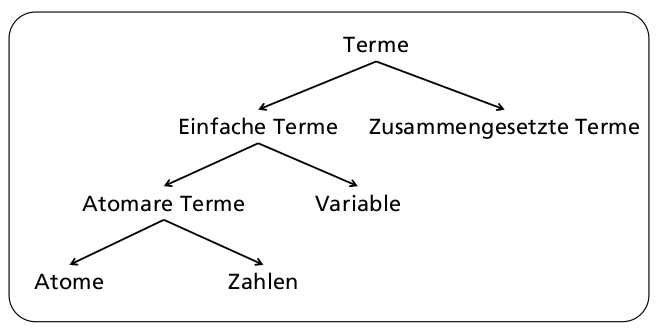

# Prolog (deklarativ logisch)

Verwendete Implementierung: [SWI-Prolog](http://swi-prolog.org)
Beispiele: [Enterpriselab PCP-public-Code](https://gitlab.enterpriselab.ch/PCP/PCP-public-Code)

## Basis

Es wird immer geschaut anhand der gegebenen Fakten was die Lösung ist.

* Wissensdatenbank (Knowledge Base)
  * Bestehend aus Fakten & Regeln
  * Kann abgefragt werden durch Anfragen (Queries
* Prolog-Programme bestehen aus Fakten und Regeln, die in der aktuellen Wissensdatenbank abgelegt sind

[Wissensdatenbank](./03-wissensdatenbank.png)

## Basissyntax

Prolog-Terme sind ausschliesslich:

* Zahlen (numbers)
  * z.B.: `123`, 4567.8, -9
* Atome (atoms)
  * beginnen mit Kleinbuchstaben oder sind eingeschlossen in einfache Anführungszeichen
  * z.B.: z.B.: `elephant`, `a_bc`, `‘Hallo mein Text‘`, #is_bigger#
* Variablen (variables)
  * z.B.: `X`, `Elephant` oder `_`
  * beginnen mit Grossbuchstaben oder einem Unterstrich (underscore)
  * Die anonyme Variaable `_`
    * Jedes auftreten ist jeweils eine neue Variable
    * Instanziierungen von `_` werden nicht ausgegeben

Zusammengesetzte Terme (compound terms)
  * z.B.: `is_bigger(horse, X)`
  * Funktor: `is_bigger`
  * Argumente (Terme): `horse`, `X`

* Atomare Terme
  * sind Atome & Zahlen

* Grundterme
  * sind alle Terme ohne Variable
  * Sind **Fakten**
  * z.B. `bigger(me, you)`, `write('bonjour')`

* Prädikate
  * wichtig eine Relation, weniger eine Funktion)
  * sind Atome und zusammengesetzte Terme
  * Praktische Bedeuting: falls Atome: **Fakten**, z.b. `bigger`
  * sonst Regeln, z.B. `is_bigger(X, Y):- bigger(X, Y)`

* Klauseln
  * Fakten und Regeln



## Prolog Anfragen:

Müssen jeweils mit einem `.` abgeschlossen sind

Ein `,` Bedeutet ein und

Eine Programm Datei kompilieren:

    ?- consult(bigger).
    % bigger.pl compiled 0.00 sec, 12 clauses
    true.
    ?-

## Klauseln (Regeln  & Fakten), Prozeduren & Programme

* Klauseln (clauses) = Fakten und Regeln (sind zusammengesetzte Terme)
  * Fakten: Prädikate gefolgt von einem Punkt
    * Fakten definieren etwas als bedingungslos warh
    * z.B. `bigger(elefant, horse)`
    * z.B. `parent(peter, mary)`
    * Fakten sind Typischerweise Grundterme und haben keine Variabeln
  * Regeln (rules) bestehen aus einem head und body & sind durch :- getrennt
    * Der Kopf einer Regel ist wahr, falls alle Prädikate im Hauptteil war sind  
      ```
      grandfather(X, Y) :- % head
          father(X, Z),  % body, goal 1
          parent(Z, Y).  % body, goal 2
      ```
    * sind eigentlich Hornklauseln: 
    * Prolog verwendet dafür SLD-Resolution (Selective Linear Definitive Clause Resolution)
      
* Prozedur (procedure) = Alle Klauseln zum gleichen Prädikat
  * d.h. Alle Relationen mit gleichem Name, d.h. Gleicher Funktor und Stelligkeit
* Prolog-Programm: eine Lsite von Klauseln.

## Matching

Definition: Zwei terMe matchen, wenn sie identisch sind oder wenn sie durch Erstezen von Variablen durch andere Terme identisch gemacht werden können

Mit dem Gleichheitsprädikat (infix) operator `=`. Alternativ kann auch als `=(a, b)` geschrieben werden.

3 Regeln von matching:

* atom & atom: `tom = tom.` gleiche atomare terme machten
* variable & atrom: `X = 'test'`, die variable X wird aufgelöst
* zusammengesetzte Terme, auch prädikate
  * gleicher Funktor, gleich Stelligkeit
  * alle korrespondierenden Argumente Machten
* Achtung ausnahme: `X = f(X).` gibt `X = f(X)` und wird nicht unendlich lang
  ausgeführt. Dies funktioniert, weil prolog keinen "occurs check" macht.
  * Wenn man trotzdem das verhalten von Unifikation anstatt von Machine haben will kann man
   `unify_with_occurs_check/2` verwendet werden.

## Beweissuche und Suchbäume

Prolog macht immer das selbe. Wenn eine Anfrage kommt prüft es ob dies auf etwas in der Wissensdatenbank mached.

Es wird sequenziell, von oben nach unten in der Wissensdatenbank gesucht.
Die Anfrage wird von links nach rechts versucht aufzulösen.


Der Baum wird von oben bis unten abgearbeitet und versucht dies Wahr zu machen.
Ist man an einem Blatt angekommen wird Backtracking verwendet falls keine Lösung gefunden wurde.
Backtracking ist *Tiefensuche* (es wird erst versucht auf die Blattknoten zu kommen).
Dies ist aber nicht sonderlich effizient (Ok^n), k = nummer an verzweigungen, n tiefe des Baumes.

Sobald die Anfrage-Klausel leer wurde eine Lösung gefunden.
Es kann dann zum Wurzelknoten zurückgegangen werden, um die Lösung zurückzugeben.
Es kann aber natürlich auch sein das es mehrere Lösungen gibt.

Falls Sie selber Suchbäume zeichnen (z.B. für Übungen oder Modulendprüfungen (MEP)): Korrekt zeichnen, d.h. insbesondere:

* Verwendete Regel bzw. Fakten pro Schritt angeben
* Pro Schritt genau einen Ziel-Term eliminieren (d.h.  keine Schritte überspringen oder zusammenfassen!)
* Pro Schritt Variablen-Matchings angeben

## Deklarative & Prozedurale Bedeutung

Wir wussten bis jetzt nicht wie Prolog jeweils auf die Lösungen kommen.
Es macht daher Sinn, zwischen folgenden zwei Bedeutungsebenen von Prolog-Programmen zu unterscheiden:

* die deklarative Bedeutung: **WAS**
  * Hier geht‘s ausschliesslich um die im Programm definierten Relationen, diese definieren was die Ausgabe vom Programm sein wird
  * Beschreibung des Problems
* die prozedurale Bedeutung: **WIE**
  * Hier geht‘s darum, wie diese Ausgabe aus den definierten Relationen abgeleitet werden kann
  * Beschreibung der Problemlösung, es wird ein Lösungsweg vorgeben

Für Prolog reicht es grundsätzlich die deklarative Bedeutung anzugeben!
